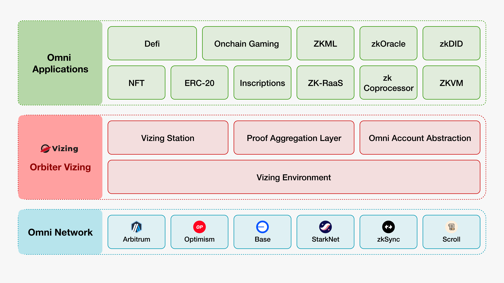

Founded in 2021, Orbiter Finance has grown in its fourth year of operation. In the fast-evolving world of Web3, a four-year period is not short, reflecting our journey through an entire bull-bear market cycle. During the last bull market, we identified the growing demand for cross-chain needs, leading to the launch of our first product, Orbiter Bridge. Today, Orbiter Bridge remains the top-tier cross-chain bridge in the industry. Over the past three years, Orbiter Bridge has facilitated 24 million transactions across over 15 blockchain networks, serving 4 million unique users. The total transaction volume has surpassed 20 billion US dollars[@OrbiterStatistics]. This success is a testament to Orbiter’s innovative capabilities in the cross-chain community. As we look ahead to 2024, we anticipate that Orbiter will continue to significantly impact the blockchain community. This article introduces Orbiter's new developments and future direction in this new era.

# Recap Cross-Chain Bridge

Most people know Orbiter Finance for its cross-chain services, mainly through our flagship product, Orbiter Bridge.  Cross-chain demand has always been a fundamental need in the blockchain sector, enabling users to transfer assets seamlessly between various blockchains, such as transferring assets from Bitcoin to Ethereum. Before 2021, achieving cross-chain transfers was very challenging, where centralized exchange (CEX) handled most of the work. While in this period, with many attempts to explore on-chain cross-chain technologies, Orbiter Finance first proposed the “Trust in Advance” concept to address the cross-chain challenge, a concept that has since proven crucial in the evolving market. We also proposed an arbitrary mechanism to maintain the security of the cross-chain service and prevent fraud and malicious activities. This innovation greatly improves cross-chain efficiency and security. For example, Optimism (OP) rollups must follow a 7-day challenge of fraud proving process for any cross-chain transaction. However, Orbiter Bridge shortens this transferring time to seconds. This performance improvement contributes to the prosperity of the multi-chain economy.  Over the last four years, the demand for cross-chain solutions has continued to grow, particularly after the release of EIP-4844 [@eip4844], which dramatically decreased the transaction fees on Ethereum Layer 2 blockchains. A significant amount of funds is shifting from Layer 1 (L1) to Layer 2 (L2). Cross-Chain Bridge has never been more important. However, as active contributors to the crypto community, we are now considering the next step of Orbiter Finance.

{width=90% height=90%}

To understand the future direction, we first revisit the release day of EIP-4844, a pivotal moment for the blockchain community and an essential milestone for Ethereum. Ethereum wants to achieve data sharding as its long-term goal, which would significantly improve the system’s scalability and performance, with EIP-4844 as a temporary solution even though this upgrade has released substantially the potential of Layer 2s for both OP roll and Zero-knowledge (ZK) rollups. The key idea is to implement the transaction format that would be used in sharding but not actually sharding those transactions. A direct consequence is that more funds are moving from L1 to L2, forming a Layer 2-centric ecosystem [@l2culture].

In this new Layer 2-centric ecosystem, we captured 3 new demands:

- **Cross-chain Communication.** Users have demands to transfer any format of messages besides assets across chains. For example, ENS plans to migrate the registry to L2, which increases the demand for Cross-chain identity recognition.
- **Security issues.** L2 provides significant scalability and efficiency improvements but also brings many new security challenges. For example, establish a decentralized network of validators responsible for the verification and confirmation of cross-chain transactions, reducing reliance on a single entity.
- **Privacy issues.** Users have privacy concerns while transferring communication cross-chain.
  
These three demands are still challenging in the blockchain community today. Orbiter will address these challenges as part of its long-term roadmap. Our brief introduction of our key contribution is listed below.

# Vizing Station: One-Stop Cross-chain Communication Framework

To address the cross-chain communication challenge, Orbiter proposes Vizing Station, a permissionless decentralized network that allows DApps to interact across multiple chains. The critical components of the Vizing Station include Launchpad, LandingPad, and ValidationPad, which work on-chain, and Validator, Relay, and Validation network, which works off-chain. Specifically, LaunchPad and LandingPad serve as information-sending and receiving hubs. Before the information is transferred to any DApps, ValidationPad is leveraged to verify its integrity and authenticity. The verified results are submitted to the Ethereum mainnet. These on-chain components inherit the security from the  Ethereum mainnet. For the off-chain part, the Validator is designed to ensure communications security. The validator receives the transactions from LaunchPad and signs to guarantee the integration of the information and further transmits it to the ValidationPad. Any third party could stake the validator to grant the authority to sign information. This mechanism introduces a decentralized nature to help maintain security in information transfer. After the information is verified and synchronized by ValidationPad, they are assigned to Relayer. To extend the Vizing Station at scale, a Relayer is designed to work off-chain to transmit information across different L2s. Relayers collect cross-chain information and determine the priority of the information. This information could either be atomic or non-atomic. The atomic transactions are aggregated to generate zero-knowledge proof (ZKP), validate it, and then submit it to the mainnet. Non-atomic transactions are stored on a specifically designed off-chain data layer for efficiency. Vizing Station performs periodic availability verification of the data to ensure its security. To guarantee the overall security of the Vizing Station, Orbiter uses an active verification system (AVS), which is called Validators Network, to support data authentication and availability. A 2/3 consensus mechanism is leveraged to make confirmations for signing the cross-chain transactions.

Based on this new framework, Vizing station offers the following new features to DApps, including but not limited to:

- **Omni-Chain Asset Bridges:** The rapid deployment of Omni-Chain asset bridges enables the wrapping of tokens from the original chain during the early stages of a newly deployed blockchain, thereby providing liquidity in WTokens to the new blockchain.
- **Omni-Chain Lending:** Omni-Chain lending is a significant feature of the Vizing protocol. Users can securely and efficiently transfer assets between blockchains, enabling borrowing and lending operations across chains. This allows users to leverage their holdings on different chains, participate in a broader range of financial activities, and achieve better capital efficiency.
- **Omni-Chain Gaming:** Vizing provides robust support for Omni-Chain gaming development. Game developers can seamlessly transfer game assets from one chain to another, creating a seamless Omni-Chain gaming experience. Players can trade, collect, and utilize game items on different blockchains, enjoying a broader gaming world and more interactive possibilities.
- **Oracles:** Unlike traditional push-based oracles, the Vizing protocol allows the development of pull-based oracles. Third-party DApps can set their intervals to fetch the latest data from other chains and apply it to on-chain smart contracts. This flexible data retrieval method provides diverse and real-time data support for various use cases, further enhancing the usability and reliability of decentralized applications.
- **Proofs Aggregation:** Vizing provides a ZK Proofs Aggregation service to significantly reduce the ZK Proofs on-chain verification cost. For the ZK developers, they just need to deploy their solidity verifier to Vizing Rollup, and submit their ZK Proofs to the Vizing Rollup, the proofs will be automatically aggregated and verified on Ethereum L1.
<!-- - **Omni-Chain DAO Governance:** The Vizing protocol also supports Omni-Chain DAO governance, enabling governance organizations on Layer 2 to participate in decision-making and voting processes on Layer 1. This Omni-Chain governance model enhances the capabilities of decentralized autonomous organizations, allowing participants from different chains to manage collectively and consistently make decisions, fostering collaborative development in the blockchain ecosystem. -->

{width=70% height=70%}

# Orbiter Network: Road to Decentralization

Security issues and network decentralization are big challenges we will solve for the Vizing Station. To address these problems, we introduce the Orbiter Network, a decentralized and scalable communication protocol built along with Vizing Station. Orbiter Network leverages the power of zero-knowledge proofs (ZKPs) to enhance security and support cross-chain communication for arbitrary data.  Supported by Orbiter, we are developing a Type-1 ZK-EVM to improve the security of ZK-Rollup, with over 200K+ nodes capable of zero-knowledge encryption. Orbiter Network aims to eliminate data tampering and fraud in cross-chain communications. The Orbiter Network participants are called producers.

The key features of Orbiter Network are:

- **Lightweight:** ZKP usually requires a high requirement on system hardware configurations. High system requirements will reduce user participation and exacerbate network centralization. We divide the transaction into minor units through batching, which encourages any user to contribute proof and verification to this network to ensure a high degree of decentralization of the Orbiter network.
- **Scalability:** As lightweight clients are supported, Orbiter Network could scale to over 200K+ nodes working simultaneously. Merker tree is stored locally on Data Nodes, while only Merker tree head is submitted to the mainnet.
- **Zero Knowledge Proof (ZKP):** Orbiter network implements ZKPs to ensure data privacy and integrity, allowing nodes to validate transactions without revealing the underlying data, which enhances security by preventing data leaks and unauthorized access.
- **Governance:** The Orbiter Network features a built-in governance system in which stakeholders vote on network decisions, including protocol upgrades and resource allocation, aiming to create a decentralized autonomous community.
- **Consensus Mechanism:** The Orbiter Network node uses Delegate Proof of Stake (DPoS) to vote on information signatures, which is fast and efficient. If 2/3 of the nodes are verified for one transaction, the transaction is approved.
- **Flexibility:** Smart contracts on Orbiter Network can be modified and upgraded, allowing developers to improve their applications without needing to deploy new contracts from scratch. The producers are assigned fine-grained responsibilities, with specific permission granted, enabling complex permission structures.
- **Usability:** Orbiter Network provides comprehensive tools and documentation for developers, including SDKs, APIs, and a developer portal to facilitate DApp development.
- **Interoperability:** The Orbiter network is designed to support communication and interaction between different blockchain networks within Vizing Station, enabling interoperability and the creation of a broader blockchain ecosystem.

Now that the Vizing Station is online and operational[@VizingOnline], we plan to launch the Orbiter Testnet in 2024.

# Multi-Prover Scheme For Vizing ZK-Rollup 

The algorithms of ZK systems are continuously iterating and innovating. In the future, the ZK-EVM prover will become increasingly efficient and cost-effective with these algorithmic iterations. The Layer2 ecosystem is an important part of the Ethereum ecosystem, and its protocol technology should keep pace with the technological innovations of the industry. If a ZK-EVM Rollup network has only one type of ZK algorithm, hackers will focus all their efforts on attacking and researching this algorithm model. ZK-EVM is an extremely large-scale technical project, and there may be some potential attack vulnerabilities that could go undetected for a long time. If this single-point prover is attacked, both security and liveness will face serious challenges. We can construct a simple mathematical model to illustrate why a multi-prover approach would be better. If the probability that ProverA encounters an instruction-proof vulnerability is $P_{A}$ , then if ProverA encounters a vulnerability and is attacked, the security of the ZK-Rollup is $1-P_{A}$.

If the Rollup network has ProverA and ProverB, two systems with identical logic but different constraints and proof systems, and the probability that ProverB encounters an instruction-proof vulnerability is as long as one system can operate normally without vulnerabilities, the entire protocol can survive securely. In this case, the security is $1-P_{A} \cdot P_{B}$. By extension, if there are $n$ types of provers at the protocol layer, then the security of the system will be

$$
1 - \prod_{i=1}^n P_i
$$

{width=50% height=50%}

In Orbiter Network, we provide two kinds of ZK-EVM prover, i.e., original 0xPolygon CDK Prover and  RISC-V ZK-EVM, which share the same EVM interpreter, ensuring consistency and compatibility across the network. The 0xPolygon CDK Prover is a proven and robust ZKP mechanism that integrates seamlessly with the Ethereum Virtual Machine (EVM). This prover is known for its reliability and performance in generating ZKPs, ensuring the privacy and integrity of transactions within the Orbiter Network. The RISC-V ZK-EVM Prover leverages the open-source RISC-V architecture to provide an alternative ZKP solution. This prover brings the flexibility and scalability of the RISC-V instruction set to the ZK-EVM ecosystem, offering a versatile option for developers. 

{width=50% height=50%}

Orbiter Network’s dual-prover approach (which may extend more approaches in the future), featuring the original 0xPolygon CDK Prover and the RISC-V ZK-EVM Prover, provides a robust and flexible zero-knowledge proof solution. The use of a shared EVM interpreter ensures consistency and compatibility, enabling a secure and efficient environment for decentralized applications. This design not only enhances the network’s security and performance but also offers developers the flexibility to choose the prover that best suits their needs, fostering innovation and growth within the Orbiter Network ecosystem.

# Decentralized Orbiter Node System

{width=70% height=70%}

Orbiter Network is a communication protocol designed for Vizing Station to enhance security through zero-knowledge proofs (ZKP) and support cross-chain communication for arbitrary information. To achieve cross-chain communitation, Vizing rollup is structured into three layers: Sequencer Layer, Verifier Layer, and Prover Layer. Each layer operates in a decentralized manner, supported by the Orbiter Network. The Sequencer Layer collects and orders messages, assigns tasks, and submits the Vizing Merkle Tree to the mainnet. The verifier layer verifies the validity of ZKPs generated within Vizing Rollup, and the Prover Layer handles the calculation of ZKPs. 

Each node in the Orbiter Network can operate in one of five modes, each with specific responsibilities to ensure efficient, secure, flexible, and stable network operation. Here is a detailed introduction to these five modes:

## Prover Mode

Prover Mode is the core function in the Orbiter Network responsible for executing ZKP computations. This mode require significant computational power. However, our batch method divides the ZKP into smaller batches, making it accessible for lightweight client users who can use their computer CPUs for computation. The primary responsibilities include:

- **Generating Proofs**: Nodes in Prover Mode generate zero-knowledge proofs to ensure the privacy and security of transactions and data.
- **Collaborative Computing**: Multiple nodes can work together to improve computational efficiency and overall network performance.
- **High-Performance Computing**: The node need robust processing capabilities and hardware support to efficient generate complex proofs.

## Verifier Mode

Verifier Mode, with relatively low network bandwidth requirements, are responsible for verifying zero-knowledge proofs. Their primary responsibilities include:

- **Proof Verification**: Verifier Mode validates zero-knowledge proofs to ensure the legality and accuracy of data and transactions.
- **Ensuring Security**: By verifying ZKPs, nodes in verification mode prevent malicious data from entering the network, maintaining the system’s security and integrity.
- **Low Bandwidth Requirement**: Since their main task is verification rather than computation, verifier mode requires less bandwidth but need reliable connectivity and stability.

## Relayer Mode

Relayer Mode handles cross-chain information in the Orbiter Network, requiring high bandwidth. Their primary responsibilities include:

- **Cross-Chain Communication Relay**: Nodes in Relayer Mode processe and transmit cross-chain messages, ensuring accurate and secure information exchange between blockchains.
- **Cross-Mode Communication Relay**: Acting as intermediaries, nodes in Relayer Mode bridge communication between nodes operating in different modes within the Orbiter Network, supporting the network’s overall integrity and stability.

## Monitor Mode

Monitoring Mode supervises the behavior of other nodes within the network, detecting and preventing fraudulent activities. Their main responsibilities include:

- **Behavior Monitoring**: Real-time monitoring of the activities of nodes in other modes, e.g., prover, verifier, and relayer to ensure their operations comply with network rules.
- **Fraud Detection**: Analyzing node behaviors to identify and report potential fraud and malicious activities.
- **Network Health Maintenance**: Ensuring all nodes operate according to established protocols and rules, maintaining the network's overall health.
  
## Data Mode

Nodes in data mode store rollup-generated off-chain information, ensuring data persistence and availability. Their main responsibilities include:

- **Data Storage**: Nodes in Data Mode store off-chain data generated by rollups, providing reliable data backup and retrieval services.
- **High Availability**: Ensuring data is always available, supporting data requests and verification needs within the network.
- **Data Integrity**: Maintaining the integrity and consistency of stored data, preventing data loss and corruption.

# Orbiter Network Slashing Mechanism

Orbiter Network incorporates a slashing mechanism designed to maintain the integrity and security of the network by penalizing malicious behavior. This mechanism serves as a deterrent against dishonest actions by nodes, ensuring that all participants adhere to the network’s rules and protocols.  The slashing mechanism in Orbiter Network is a security protocol that penalizes nodes engaging in malicious or dishonest activities. This mechanism aims to protect the network’s integrity by reducing the likelihood of fraudulent behavior and ensuring that all nodes operate according to the established rules.

The slashing mechanism begins with the continuous monitoring of node activities by dedicated monitoring nodes. These nodes utilize advanced algorithms to detect anomalies and deviations from expected behaviors, which could indicate potential malicious activities. When a monitoring node detects suspicious activity, it reports the behavior to the network, initiating a verification process. The reported activity is then verified by a quorum of verification nodes to ensure the accuracy and validity of the claim. This decentralized verification process prevents false accusations and ensures fairness. If the verification nodes confirm that a node has engaged in malicious behavior, the slashing penalties are enforced. These penalties typically involve the confiscation of a portion or all of the offending node’s staked tokens. In addition to financial penalties, the node’s reputation within the network is negatively impacted, reducing its chances of being selected for future tasks. For minor infractions, nodes may receive a temporary ban from participating in network activities. For severe or repeated offenses, nodes can be permanently removed from the network, ensuring long-term security and stability. To encourage honest behavior, the network implements a reward system where nodes that successfully identify and report malicious activities are rewarded with a portion of the slashed tokens. This incentive ensures active participation in maintaining network security.

# Orbiter Network Staking Mechanism

Orbiter Network proposes a sophisticated staking mechanism and a hierarchical node structure. This design ensures both decentralization and operational efficiency, leveraging the strengths of zero-knowledge proofs (ZKP) and multi-tiered node interactions. The node architecture in Orbiter Network is organized into a hierarchical structure consisting of multiple tiers: lower-tier nodes and upper-tier nodes. Each tier plays a critical role in aggregating and processing information to ensure seamless network operations. The lower-tier nodes are primarily operated by individual users. These nodes perform basic network tasks such as transaction submission and initial ZKP calculations. These nodes collect and process data locally before transmitting it to the middle-tier nodes. This distributed approach enhances the network’s decentralization by allowing widespread participation. Upper-tier nodes have the additional responsibility of staking token assets as a form of reputation guarantee. This staking mechanism ensures that these nodes have a vested interest in maintaining the integrity and reliability of the network. These nodes aggregate information from the lower-tier nodes, performing final data validation and ensuring the consistency and accuracy of the information before it is propagated across the network. Due to their crucial role, upper-tier nodes require significant computational and bandwidth resources to handle the high volume of data processing and validation tasks. The staking mechanism in the Orbiter Network is designed to enhance the security and trustworthiness of the network by requiring upper-tier nodes to stake token assets. This serves as a reputation guarantee and a deterrent against malicious behavior.

Orbiter Network’s hierarchical node structure and staking mechanism work in tandem to ensure a secure, efficient, and decentralized communication protocol. By leveraging the strengths of zero-knowledge proofs and a multi-tiered node architecture, Orbiter Network achieves high performance while maintaining the trust and integrity essential for modern blockchain applications. This innovative design positions Orbiter Network as a leading solution in the blockchain ecosystem, capable of supporting diverse and complex cross-chain communication needs.

User can particpate in building Orbiter Network by constructing their own Orbiter Nodes. The specfic mode of the running nodes is decided by user preference or the hardware capabilities. This approach ensures that the network can leverage a diverse range of resources, enhancing its decentralization and efficiency. By allowing users to choose or adapt their nodes based on their available resources, Orbiter Network promotes widespread participation and optimizes overall network performance.

# What's Next for Orbiter Finance?

This article outlines the long-term goal of Orbiter Finace to rebrand as a comprehensive cross-chain communication framework. This transfromation includes the inroduction of new products and concepts such as Vizing Station, Orbiter network, and Vizing ZK-Rollups, Our ambitious vision will be implemented incrementally over the next few years. We confident that Orbiter Finance will become a major force in leading cross-chain communication and will continue to contribute significantly to the blockchain community. Our commitment to innovation and excellence will drive us to develop solutions that address current challenges and anticipate future needs. As we embark on this journey, we invite the blockchain community to join us in shaping the future of cross-chain communication. Together, we can build a more connected, efficient, and secure blockchain ecosystem.

# REFERENCES\
